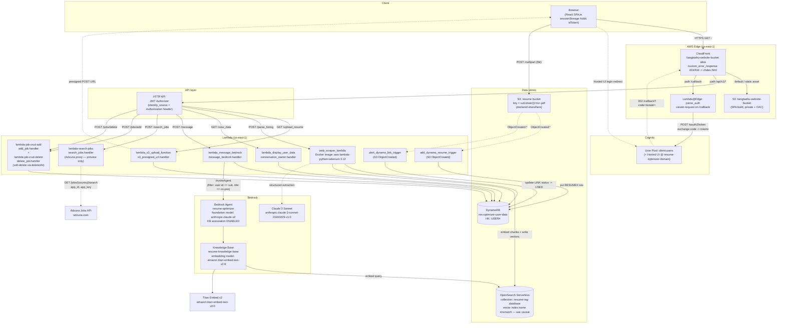
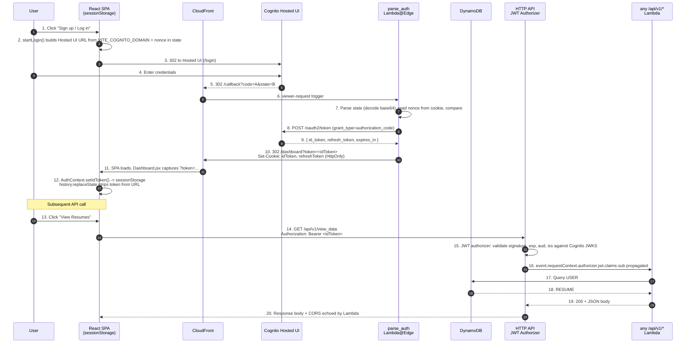
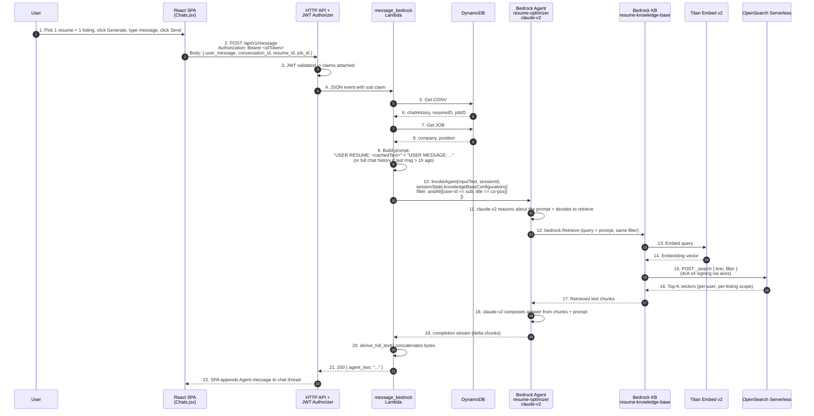

# Backend architecture

Three views of the same system:

1. **System overview** — which components exist and how they connect.
2. **Auth flow** — request-level sequence for sign-in.
3. **Chat-with-RAG flow** — the most layered flow in the app (SPA → API Gateway → Lambda → Bedrock Agent → KB → OpenSearch).

## 1. System overview

Notes on the graph above:
- The same Cognito `sub` claim flows to (a) DynamoDB `USER#` keying, (b) S3 resume object key prefix `<sub.lower()>/<file>.pdf`, (c) OpenSearch vector metadata `user-id=`, and (d) the Bedrock KB retrieval filter.
- DynamoDB layout (single-table): `USER#` + `RESUME#<file>` | `LINK` | `JOB#<company>-<position>` | `CONV#<id>` (full key patterns documented in `serverless_services/dynamodb.tf`).
- **Keyword search & soft-delete flow:** `/search_jobs` is a stateless Adzuna proxy — it does not write to DynamoDB. `/jobs/add` writes a `JOB#<co>-<pos>` row with `status: PENDING_INGEST`. `/jobs/delete` performs a *soft* delete by setting `deletedAt = <iso8601>`; the row stays in DynamoDB for future restore but `view_data`'s `JOB#` query filters on `attribute_not_exists(deletedAt)` so soft-deleted rows never reach the SPA. OpenSearch vectors for soft-deleted listings are orphaned (a known follow-up).

## 2. Sign-in flow (sequence)

`parse_auth` Lambda@Edge runs as a `viewer-request` hook on the `/callback` cache behavior. API Gateway JWT authorizer runs as the request validator on every `/api/v1/*` route.

## 3. Chat-with-RAG flow (sequence)

This is the most layered request in the system. The Bedrock Agent picks the KB, the KB embeds the query and retrieves vectors from OpenSearch, and the Agent synthesizes the answer using `anthropic.claude-v2`. The filter `user-id == sub AND title == company-position` is what scopes retrieval to the user's own uploaded listing.

Caveats this diagram does *not* hide:
- The OpenSearch index name in `parse_listing/lambda_scraper.py` is `f"{sub.lower()}-job-listings"` (one index per user), but `serverless_services/bedrock.tf` declares the KB's `vector_index_name` as `resume-rag-database`. Until those are reconciled, step 15 returns nothing and the agent falls back to model knowledge only.
- DynamoDB-`CACHE` TTL is set on the `expiresIn` attribute via the table-level `ttl` block, but `expiresIn` is only written today by `LINK` rows; `RESUME`/`JOB`/`CONV` rows have no expiry.
- Bedrock KB agent association is `knowledgeBase_state = ENABLED` in `bedrock.tf` but the `agent_version` and `prepare_flow` lifecycle steps are skipped — Bedrock auto-prepares on first invoke.
